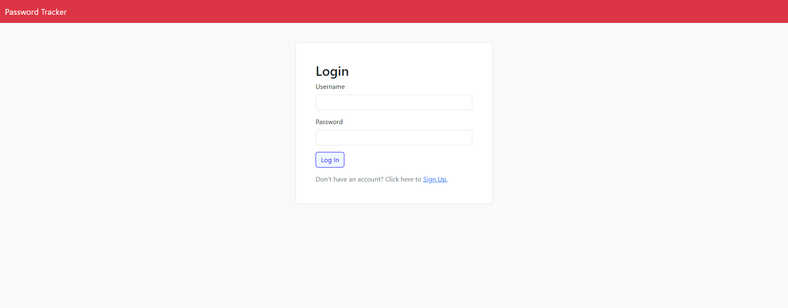
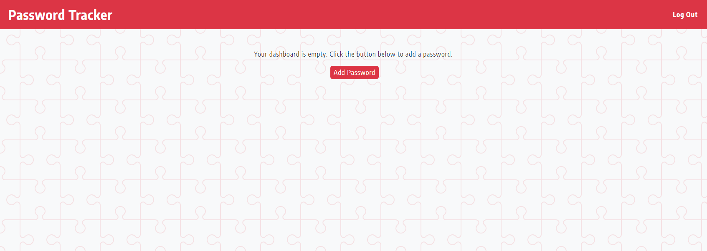
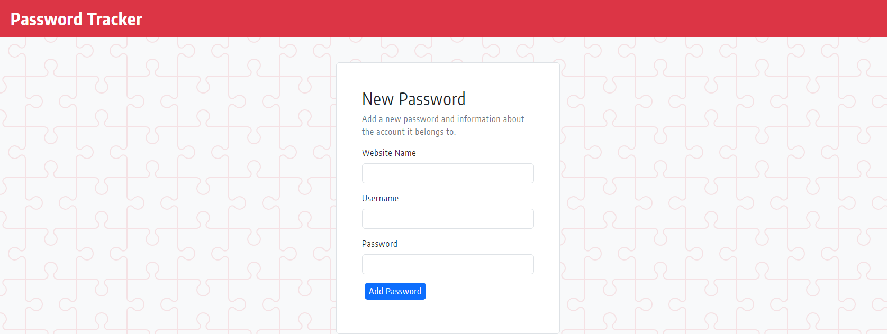

# Password Tracker

## Description
This project solves the issue of keeping track of passwords related to certain accounts securely. This account taught us how to set up models related to data storage and using that data to to display relevant data to that user. This is done through sessions and handlebars.

## Installation

To use our application please visit: 
 Login or Signup to use or application.

## Usage

These screenshots show images of our webpage/application.

.png)

## Credits

The following contributed to this project:
 **Anthony Cedrone**:
 https://github.com/antced
 **Alexander Barlow**:
 https://github.com/AlexanderBarlow
 **Connor Cho**:
 https://github.com/connorcho66
 **Rahel Hailu**:
 https://github.com/ririhailu

## Features

Our project features the use of a database and many npmjs packages that include:
check-password-strength, connect-session-sequelize, dotenv, express, express-handlebars, express-session, mysql2 and sequelize

## How to Contribute

To contribute please contact any of the current contributors listed above.
